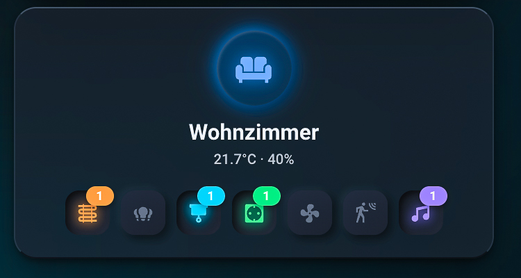
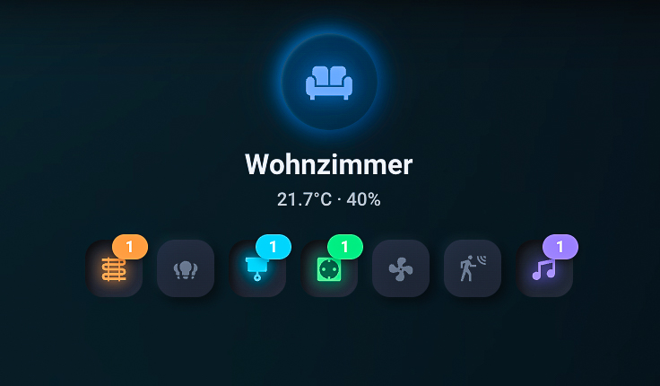
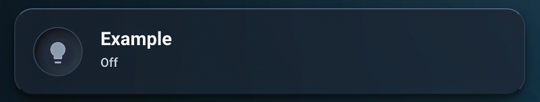
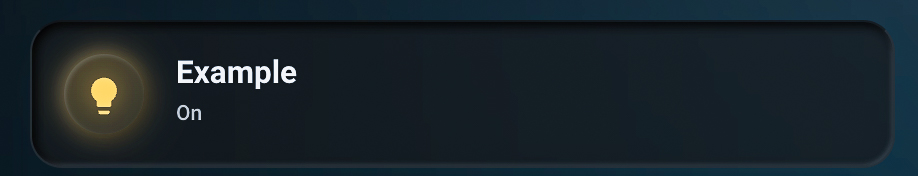
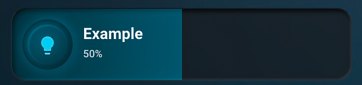
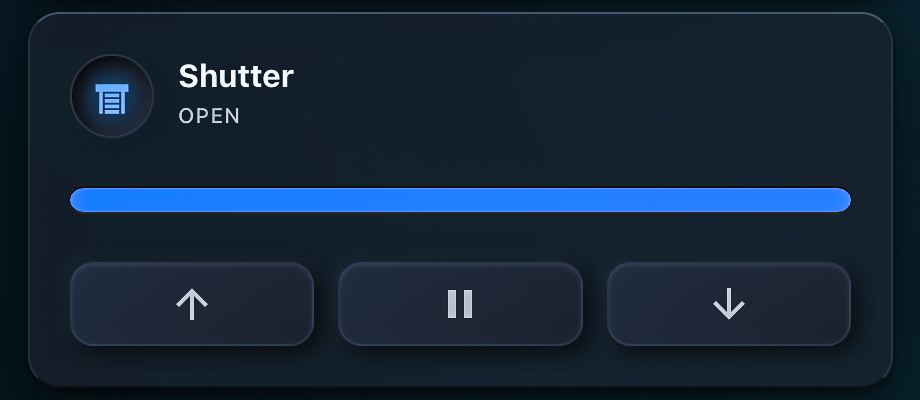
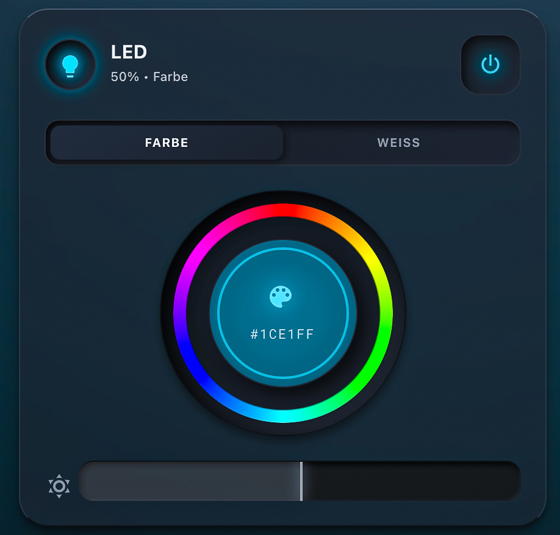
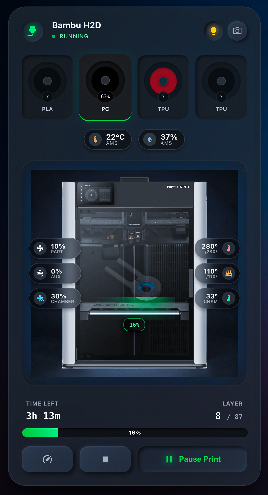
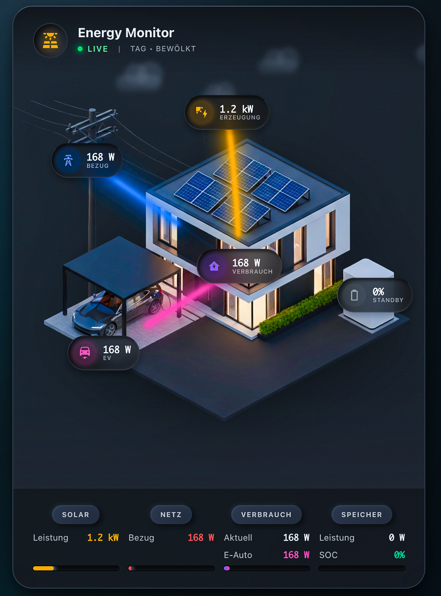

## Custom Cards

> **💡 Tip:** After adding the cards to Resources, you can find them in the Dashboard Editor (preview section) by searching for "prism". All Prism cards will then be displayed.

---

### prism-room

A compact room overview card with temperature, humidity, grouped entities, and status icons. Click to open a popup with all room devices grouped by type.



**With transparent background:**



**Features:**
- ✅ **Compact Room Card**: Shows room icon, name, temperature, and humidity
- ✅ **Grouped Entities**: Organize lights, climate, motion sensors, media players, covers, switches, fans, and other entities in separate groups
- ✅ **Status Icons with Badges**: Shows grouped entities with badge counters (e.g., "3 lights on")
- ✅ **Unique Colors**: Each entity type has its own distinct color
- ✅ **Hide Card Background**: Optional transparent mode (show only icons and text)
- ✅ **Grouped Popup**: Click card to open popup with all entities, grouped by type
- ✅ **Two-Column Layout**: Popup displays up to 2 groups side by side (responsive)
- ✅ **Real-time Updates**: Popup updates automatically when entity states change
- ✅ **Interactive Entities**: Tap to toggle, long-press for more-info dialog
- ✅ **Neumorphism Design**: Modern neumorphism effects for all icons and buttons

**Usage:**

```yaml
type: custom:prism-room
name: "Living Room"
icon: mdi:sofa
hide_card_background: false  # Optional: true = transparent background (only icons/text)
temperature_entity: sensor.living_room_temperature
humidity_entity: sensor.living_room_humidity

# Grouped entities (displayed in popup grouped by type)
light_entities:
  - light.living_room_ceiling
  - light.living_room_floor_lamp
  - light.living_room_spots

climate_entities:
  - climate.living_room

motion_entities:
  - binary_sensor.living_room_motion

media_entities:
  - media_player.living_room_tv

cover_entities:
  - cover.living_room_blinds

switch_entities:
  - switch.living_room_outlet

fan_entities:
  - fan.living_room_fan

other_entities:
  - scene.living_room_evening
other_entities_icon: mdi:palette  # Optional: Custom icon for "Other" group
```

**Status Icon Colors:**

| Icon | Entity Type | Color | Hex |
|------|-------------|-------|-----|
| 🔥 Heating | Climate | Orange | `#fb923c` |
| 💡 Lights | Lights | Yellow | `#ffc864` |
| 🪟 Covers | Covers/Blinds | Cyan | `#22d3ee` |
| 🔌 Switches | Switches | Green | `#4ade80` |
| 🌀 Fans | Fans | Sky Blue | `#38bdf8` |
| 🚶 Motion | Motion Sensors | Indigo | `#818cf8` |
| 🎵 Media | Media Players | Purple | `#a78bfa` |
| ⚙️ Other | Other Entities | Gray | `#94a3b8` |

**Popup Groups:**

Entities are automatically grouped and displayed in the popup:
1. **Lights** (Lichter)
2. **Climate** (Heizungen)
3. **Motion Sensors** (Bewegungsmelder)
4. **Media Players** (Mediaplayer)
5. **Covers** (Rollläden)
6. **Switches** (Schalter)
7. **Fans** (Ventilatoren)
8. **Other** (Sonstige)

**Interactions:**

- **Card Click**: Opens popup with all grouped entities
- **Entity Click in Popup**: Toggles the entity (lights, switches, fans, etc.)
- **Entity Long-Press**: Opens Home Assistant's more-info dialog
- **Climate Toggle**: Switches between heat/off modes
- **Covers**: Opens/closes blinds
- **Scenes/Scripts**: Activates when clicked

**Transparent Background Mode:**

Set `hide_card_background: true` to remove the glassmorphism background and display only the content (icon, name, status icons). Perfect for minimalist dashboards or when embedding the card in a colored container.

---

### prism-heat

A custom thermostat knob card with glassmorphism design and optional compact mode.

**Normal Mode:**


**Compact Mode:**


**Features:**
- ✅ **Circular Thermostat Knob**: Drag to adjust temperature
- ✅ **Current & Target Temperature**: Shows both temperatures in the knob
- ✅ **Mode Buttons**: Off/Manual/Auto modes
- ✅ **Compact Mode**: Optional mode showing only the knob (no card wrapper)
- ✅ **Color Glow**: Active heating shows orange glow effect
- ✅ **Touch/Mouse Support**: Smooth drag interaction

**Usage:**
```yaml
- type: custom:prism-heat
  entity: climate.living_room
  name: Living Room
  color: "#fb923c"
  compact_mode: false  # Optional: true for minimalistic knob only
```

---

### prism-heat-small

A compact heating card with inlet styling and simple temperature controls.


**Usage:**
```yaml
- type: custom:prism-heat-small
  entity: climate.living_room
  name: Living Room
```

---

### prism-button

A glassmorphism-styled entity button card with neumorphism effects, glowing icon circle, and optional brightness slider.

**Default State:**



**Active State:**



**With Brightness Slider:**



**Features:**
- ✅ **Neumorphism Effect**: Icon pressed when active, raised when inactive
- ✅ **Glowing Icon Circle**: Color glow when entity is active
- ✅ **Horizontal/Vertical Layout**: Choose between horizontal or vertical layout
- ✅ **Brightness Slider**: Optional background slider for lights with brightness control
- ✅ **Tap/Hold Actions**: Tap to toggle, hold for more-info
- ✅ **Separate Slider Entity**: Optional separate entity for slider control

**Usage:**
```yaml
- type: custom:prism-button
  entity: light.living_room_light
  name: Living Room
  icon: mdi:lightbulb
  layout: horizontal  # or vertical
  active_color: "#ffc864"
  show_brightness_slider: true  # Default: true for lights
  slider_entity: light.other_lamp  # Optional: Separate entity for slider
```

---

### prism-media

A media player card with glassmorphism design and inlet styling.


**Usage:**
```yaml
- type: custom:prism-media
  entity: media_player.living_room_speaker
  playing_color: "#60a5fa"
```

---

### prism-calendar

A calendar card with glassmorphism design for displaying upcoming events.


**Usage:**
```yaml
- type: custom:prism-calendar
  entity: calendar.family_shared
  max_events: 5
  icon_color: "#f87171"
  dot_color: "#f87171"
```

---

### prism-shutter

A horizontal shutter card with inlet slider and glassmorphism design.



**Usage:**
```yaml
- type: custom:prism-shutter
  entity: cover.living_room_shutter
  name: Living Room
```

---

### prism-shutter-vertical

A vertical shutter card with inlet slider and compact design.


**Usage:**
```yaml
- type: custom:prism-shutter-vertical
  entity: cover.bedroom_shutter
  name: Bedroom
```

---

### prism-vacuum

A vacuum robot card with inlet styling, animation, and suction power control.


**Usage:**
```yaml
- type: custom:prism-vacuum
  entity: vacuum.robot_vacuum
  name: Vacuum
```

---

### prism-led

An LED light card with interactive color wheel, white temperature control, and brightness adjustment.



**Usage:**
```yaml
- type: custom:prism-led
  entity: light.living_room_led
  name: Living Room LED
```

---

### prism-3dprinter

A 3D printer card with glassmorphism design for displaying progress, temperatures, fans, and layer info.


**Usage:**
```yaml
- type: custom:prism-3dprinter
  entity: sensor.3d_printer_state        # Sensor/Entity with printer status & attributes
  name: 3D Printer
  camera_entity: camera.3d_printer       # Optional: Printer camera
  image: /hacsfiles/Prism-Dashboard/images/printer-blank.jpg  # Optional, default is automatically used
```

---

### prism-bambu

A Bambu Lab 3D printer card with AMS (Automatic Material System) support, glassmorphism design, and full display of print progress, temperatures, fans, layer info, and all 4 AMS slots.



**Usage:**

**Basic Configuration (Visual Editor):**
```yaml
- type: custom:prism-bambu
  printer: <device_id>  # Bambu Lab printer device (e.g., from Device Registry)
  name: Bambu Lab Printer  # Optional: Custom Name
  image: /hacsfiles/Prism-Dashboard/images/printer-blank.jpg  # Optional: Printer image (default is automatically used)
```

**Advanced Configuration (with AMS and Camera):**
```yaml
- type: custom:prism-bambu
  printer: <device_id>  # Bambu Lab printer device
  ams_device: <ams_device_id>  # Optional: AMS device (if multiple AMS present)
  name: Bambu Lab Printer
  camera_entity: camera.x1c_1_kamera  # Optional: Camera Entity
  image: /local/custom-components/images/prism-bambu-pic.png  # Optional: .png or .jpg
```

**Note:** The card uses Home Assistant's **Device Registry** and automatically filters all relevant entities based on the selected printer device. This works exactly like the official [ha-bambulab Cards](https://github.com/greghesp/ha-bambulab-cards).

**Features:**
- ✅ **AMS Support**: Shows all 4 AMS slots with color visualization
- ✅ **Filament Type Detection**: Supports PCTG, PETG, PLA, ABS, TPU, ASA, PA-CF, PA, PC, PVA, HIPS, PP
- ✅ **Remaining Amount Display**: Shows `?` if RFID tracking is not active, otherwise percentage
- ✅ **Active Slot**: Automatically highlighted
- ✅ **Live Camera Stream**: Toggle between printer image and live video stream
- ✅ **Camera Popup**: Click on camera opens large More-Info window
- ✅ **Chamber Light Control**: Light button to turn chamber lighting on/off
- ✅ **Dynamic Image**: Printer image is darkened when light is off
- ✅ **Interactive Buttons**: Pause/Stop/Speed with correct state logic
- ✅ **Temperature Overlays**: Nozzle, Bed, Chamber with target temperatures
- ✅ **Fan Speeds**: Part & Aux Fan display
- ✅ **Layer Information**: Current Layer / Total Layers
- ✅ **Progress Bar**: Visual progress bar with percentage
- ✅ **Status Indicator**: Colored dot (green=pulsing when printing, yellow=paused, gray=idle)

**Configuration in Visual Editor:**

1. **Printer Device**: Select your Bambu Lab printer device from the device list
2. **AMS Device** (optional): If multiple AMS present, select the desired AMS device
3. **Name** (optional): Custom name for the card
4. **Camera Entity** (optional): Camera entity for live stream
5. **Image** (optional): Path to printer image (`.png` or `.jpg`)

**Automatic Entity Detection:**

The card automatically detects all relevant entities based on the printer device:

- **Print Status**: `print_status` Entity
- **Temperatures**: `nozzle_temp`, `bed_temp`, `chamber_temp` with target temperatures
- **Fans**: `cooling_fan_speed` (Part Fan), `aux_fan_speed` (Aux Fan)
- **Progress**: `print_progress`, `remaining_time`, `current_layer`, `total_layers`
- **Chamber Light**: `chamber_light` Entity (automatically detected)
- **Camera**: `camera` Entity (automatically detected or can be set manually)
- **AMS Slots**: `tray_1`, `tray_2`, `tray_3`, `tray_4` Entities (via `translation_key`)

**AMS Data:**

The card reads AMS data from tray entities (`sensor.*_slot_1`, `sensor.*_slot_2`, etc.):

- **Filament Type**: Extracted from `attributes.name` or `attributes.type` (e.g., "Bambu PCTG Basic" → "PCTG")
- **Color**: `attributes.color` (automatically converted from #RRGGBBAA to #RRGGBB)
- **Remaining**: `attributes.remain` (shows `?` if `remain_enabled: false`)
- **Active**: `attributes.active` or `attributes.in_use`
- **Empty**: `attributes.empty` or empty state

**Upload Image:**

**Images:**
- The default printer image (`printer-blank.jpg`) is automatically installed with HACS
- Default path: `/hacsfiles/Prism-Dashboard/images/printer-blank.jpg`
- You can specify a custom image path in the `image` field if needed
- The card supports both `.png` and `.jpg` formats
4. As a last fallback, a printer icon is displayed

**Interactions:**

- **Light Button**: Toggle Chamber Light on/off (button shows immediate feedback)
- **Camera Button**: Switches between printer image and live camera stream
- **Click Camera Image**: Opens large More-Info popup (like HA image entities)
- **Pause Button**: Opens More-Info dialog for print status (only active when printer is printing/paused)

**ha-bambulab Integration:**
The card is compatible with the [ha-bambulab Integration](https://github.com/greghesp/ha-bambulab) and works like the [official Bambu Lab Cards](https://github.com/greghesp/ha-bambulab-cards).

---

### prism-creality

A Creality 3D printer card with glassmorphism design and full display of print progress, temperatures, fans, layer info. Supports K1, K1C, K1 Max, K1 SE and other Creality printers.


**Usage:**

**Basic Configuration (Visual Editor):**
```yaml
- type: custom:prism-creality
  printer: <device_id>  # Creality printer device (e.g., from Device Registry)
  name: Creality Printer  # Optional: Custom Name
  image: /hacsfiles/Prism-Dashboard/images/printer-blank.jpg  # Optional: Printer image (default is automatically used)
```

**Advanced Configuration (with Camera and Light):**
```yaml
- type: custom:prism-creality
  printer: <device_id>  # Creality printer device
  name: Creality K1 SE
  camera_entity: camera.creality_k1_se_camera  # Optional: Camera Entity
  light_switch: switch.creality_light  # Optional: Light Switch Entity
  image: /local/custom-components/images/prism-creality.webp  # Optional: .webp, .png or .jpg
```

**Note:** The card uses Home Assistant's **Device Registry** and automatically filters all relevant entities based on the selected printer device. This works with the [Creality-Control Integration](https://github.com/SiloCityLabs/Creality-Control) and additionally supports [Moonraker](https://github.com/marcolivierarsenault/moonraker-home-assistant) for rooted printers.

**Features:**
- ✅ **Auto-Entity Detection**: Automatic detection of Light Switch and Camera entities
- ✅ **Live Camera Stream**: Toggle between printer image and live video stream
- ✅ **Camera Popup**: Click on camera opens large More-Info window
- ✅ **Light Control**: Light button to turn printer lighting on/off
- ✅ **Dynamic Image**: Printer image is darkened when light is off
- ✅ **Interactive Buttons**: Pause/Resume, Stop, Home All Axes with correct state logic
- ✅ **Temperature Overlays**: Nozzle, Bed, Box/Chamber with target temperatures
- ✅ **Fan Speeds**: Model Fan, Auxiliary Fan, Case Fan display
- ✅ **Layer Information**: Current Layer / Total Layers
- ✅ **Progress Bar**: Visual progress bar with percentage
- ✅ **Status Indicator**: Colored dot (green=pulsing when printing, yellow=paused, gray=idle)
- ✅ **Power Switch**: Optional power button (green=on, gray/red=off)

**Configuration in Visual Editor:**

1. **Printer Device**: Select your Creality printer device from the device list
2. **Name** (optional): Custom name for the card
3. **Camera Entity** (optional): Camera entity for live stream (also auto-detected)
4. **Light Switch** (optional): Light/Switch entity for lighting (also auto-detected)
5. **Image** (optional): Path to printer image (`.webp`, `.png` or `.jpg`)

**Automatic Entity Detection:**

The card automatically detects all relevant entities based on the printer device:

- **Print Status**: `print_state` or `device_state` Entity
- **Temperatures**: `nozzle_temp`, `bed_temp`, `box_temp` with target temperatures
- **Fans**: `model_fan_pct`, `auxiliary_fan_pct`, `case_fan_pct`
- **Progress**: `print_progress`, `time_left`, `current_layer`, `total_layer`
- **Light Switch**: `switch.creality_light` (automatically detected)
- **Camera**: `camera.creality_*_camera` (automatically detected or can be set manually)

**Supported Printer Models:**

- ✅ **K1, K1C, K1 Max, K1 SE** (FDM printers)
- ✅ **K2 Plus, K2 Pro** (FDM printers)
- ✅ **Halot Series** (Resin printers)
- ✅ Other Creality printers with WebSocket support

**Creality-Control Integration:**
The card is compatible with the [Creality-Control Integration](https://github.com/SiloCityLabs/Creality-Control) and uses all available sensors, switches, buttons, and camera entities.

**Moonraker Support (Additional):**
For rooted Creality printers running Klipper/Moonraker, the card also supports the [Moonraker Home Assistant Integration](https://github.com/marcolivierarsenault/moonraker-home-assistant). The card automatically detects entities based on your **device name** in Home Assistant (e.g., device "K1-098D" → finds entities like `sensor.k1_098d_bed_temperature`).

**Images:**
- The default printer image (`printer-blank.jpg`) is automatically installed with HACS
- Default path: `/hacsfiles/Prism-Dashboard/images/printer-blank.jpg`
- You can specify a custom image path in the `image` field if needed
- The card supports `.webp`, `.png` and `.jpg` formats
- As a last fallback, a printer icon is displayed

**Interactions:**

- **Light Button**: Toggle Light on/off (button shows immediate feedback)
- **Camera Button**: Switches between printer image and live camera stream
- **Click Camera Image**: Opens large More-Info popup (like HA image entities)
- **Pause Button**: Pause/Resume Print (only active when printer is printing/paused)
- **Stop Button**: Stop Print (only active when printer is printing/paused)
- **Home Button**: Home All Axes (only active when printer is idle)
- **Power Button**: Toggle Power Switch (if configured)

---

### prism-energy

An energy flow card with glassmorphism design for visualizing solar generation, grid import/export, battery storage, home consumption, and EV charging. Optimized for the [OpenEMS/Fenecon Integration](https://github.com/Lamarqe/ha_openems).



**Features:**
- ✅ **Animated Energy Flows**: Visualizes energy flow between all components
- ✅ **Solar Production**: Shows current PV power with animation
- ✅ **Grid Integration**: Import/export with color distinction
- ✅ **Battery Storage**: SOC display with dynamic icon and charge/discharge status
- ✅ **Home Consumption**: Current consumption power
- ✅ **EV Charging** (optional): EV charging power when configured
- ✅ **Autarky Badge** (optional): Shows self-consumption rate
- ✅ **Details Section**: Optional statistics section with bar visualization
- ✅ **Visual Editor**: Full configuration via Home Assistant UI Editor

---

#### Prerequisites

This card is optimized for the **[ha_openems Integration](https://github.com/Lamarqe/ha_openems)** (Fenecon FEMS / OpenEMS).

1. Install the integration via HACS
2. Configure your FEMS/OpenEMS system
3. Enable the required entities (see below)

---

#### Finding Required Entities

After installing the ha_openems integration, you can find the entities under **Settings → Devices & Services → OpenEMS**.

**How to find your System ID:**
- Your entities have the format: `sensor.<system_id>_sum_<channel>`
- Example: `sensor.fems79420_sum_productionactivepower`
- The System ID is the part before `_sum` (e.g., `fems79420`)

**Enable Required Entities:**

Go to **Settings → Devices & Services → OpenEMS → X Entities** and enable:

| Entity | Channel | Description |
|--------|---------|-------------|
| `sensor.<system>_sum_productionactivepower` | ProductionActivePower | ☀️ Solar Production (Watt) |
| `sensor.<system>_sum_gridactivepower` | GridActivePower | 🔌 Grid Power (Watt) |
| `sensor.<system>_sum_esssoc` | EssSoc | 🔋 Battery State of Charge (%) |
| `sensor.<system>_sum_essdischargepower` | EssDischargePower | 🔋 Battery Power (Watt) |
| `sensor.<system>_sum_consumptionactivepower` | ConsumptionActivePower | 🏠 Home Consumption (Watt) |

**Optional Entities:**

| Entity | Channel | Description |
|--------|---------|-------------|
| `sensor.<system>_evcs0_chargepower` | ChargePower | 🚗 EV Charging Power (Watt) |

**Solar Module (Charger) Entities:**

If you have multiple solar chargers/inverters, you can display them individually:

| Entity | Channel | Description |
|--------|---------|-------------|
| `sensor.<system>_charger0_actualpower` | ActualPower | ☀️ Charger 0 Power (Watt) |
| `sensor.<system>_charger1_actualpower` | ActualPower | ☀️ Charger 1 Power (Watt) |
| `sensor.<system>_charger2_actualpower` | ActualPower | ☀️ Charger 2 Power (Watt) |
| `sensor.<system>_charger3_actualpower` | ActualPower | ☀️ Charger 3 Power (Watt) |

> 💡 **Tip:** The charger numbers correspond to the individual inverters/PV strings of your system. Configure these in the card under "Solar Module" and give each one a descriptive name (e.g., "South Roof", "Carport", etc.).

---

#### Create Autarky Sensor

> ⚠️ **Important:** The ha_openems integration does **not provide a direct autarky entity**. You must create a template sensor!

**Method 1: Via Home Assistant UI (recommended, from HA 2023.3)**

1. Go to **Settings → Devices & Services → Helpers**
2. Click **Create Helper** (bottom right)
3. Select **Template** from the list
4. Fill in the fields:
   - **Name**: `Energy Autarky`
   - **Unit**: `%`
   - **Icon**: `mdi:leaf`
   - **Template**: Copy the following code (replace `YOUR_SYSTEM_ID` with your system ID):

```jinja2



  
  {{ ((1 - (grid_used / consumption)) * 100) | round(0) }}

  100

```

5. Click **Create**

**Example:** If your entity is `sensor.fems79420_sum_consumptionactivepower`, then your System ID is `fems79420`. So replace `YOUR_SYSTEM_ID` with `fems79420`.

**Method 2: Via configuration.yaml (for advanced users)**

If you prefer YAML, add the following code to your `configuration.yaml`:

```yaml
template:
  - sensor:
      - name: "Energy Autarky"
        unique_id: energy_autarky_percentage
        unit_of_measurement: "%"
        state_class: measurement
        icon: mdi:leaf
        state: >
          
          
          
            
            {{ ((1 - (grid_used / consumption)) * 100) | round(0) }}
          
            100
          
```

**Replace `YOUR_SYSTEM_ID` with your actual System ID!**

After restarting Home Assistant, you will have `sensor.energy_autarky` available.

**Autarky Formula:**
```
Autarky = (1 - (Grid Import / Consumption)) × 100%

Examples:
- Consumption 1000W, Grid Import 200W → Autarky = 80%
- Consumption 1000W, Grid Import 0W   → Autarky = 100%
- During Export (negative)           → Autarky = 100%
```

---

#### Card Configuration

**Usage (Visual Editor recommended):**

The card can be fully configured via the Visual Editor. Simply search for "Prism Energy" in the card selection dialog.

**YAML Configuration:**
```yaml
type: custom:prism-energy
name: Energy Monitor
solar_power: sensor.fems79420_sum_productionactivepower
grid_power: sensor.fems79420_sum_gridactivepower
battery_soc: sensor.fems79420_sum_esssoc
battery_power: sensor.fems79420_sum_essdischargepower
home_consumption: sensor.fems79420_sum_consumptionactivepower
ev_power: sensor.fems79420_evcs0_chargepower  # Optional - only if EV present
autarky: sensor.energy_autarky  # Optional - template sensor from above
image: /hacsfiles/Prism-Dashboard/images/prism-energy-home.png  # Optional, default is automatically used
show_details: true
```

**Advanced Configuration with Solar Modules:**
```yaml
type: custom:prism-energy
name: Energy Monitor
solar_power: sensor.fems79420_sum_productionactivepower
grid_power: sensor.fems79420_sum_gridactivepower
battery_soc: sensor.fems79420_sum_esssoc
battery_power: sensor.fems79420_sum_essdischargepower
home_consumption: sensor.fems79420_sum_consumptionactivepower
show_details: true
# Display solar modules individually (optional)
solar_module1: sensor.fems79420_charger0_actualpower
solar_module1_name: "Office Left"
solar_module2: sensor.fems79420_charger1_actualpower
solar_module2_name: "Office Right"
solar_module3: sensor.fems79420_charger2_actualpower
solar_module3_name: "House"
```

---

#### Configuration Options

| Option | Type | Required | Description |
|--------|------|----------|-------------|
| `name` | string | No | Card name (default: "Energy Monitor") |
| `solar_power` | entity | Yes | Solar production sensor (total) |
| `grid_power` | entity | Yes | Grid power sensor (positive=import, negative=export) |
| `battery_soc` | entity | Yes | Battery state of charge in % |
| `battery_power` | entity | Yes | Battery power (positive=discharge, negative=charge) |
| `home_consumption` | entity | Yes | Home consumption sensor |
| `ev_power` | entity | No | EV charging power (if not set, EV is not displayed) |
| `autarky` | entity | No | Autarky percentage (if not set, badge is not displayed) |
| `image` | string | No | Path to house image (default: prism-energy-home.png) |
| `show_details` | boolean | No | Show details section at bottom (default: true) |
| **Solar Module** | | | *Optional individual display of solar chargers in detail section* |
| `solar_module1` | entity | No | Solar Charger 1 Entity (e.g., `charger0_actualpower`) |
| `solar_module1_name` | string | No | Name for module 1 (e.g., "Office Left") |
| `solar_module2` | entity | No | Solar Charger 2 Entity |
| `solar_module2_name` | string | No | Name for module 2 (e.g., "Office Right") |
| `solar_module3` | entity | No | Solar Charger 3 Entity |
| `solar_module3_name` | string | No | Name for module 3 (e.g., "House") |
| `solar_module4` | entity | No | Solar Charger 4 Entity |
| `solar_module4_name` | string | No | Name for module 4 |
| **Pill Positions** | | | *Optional - customize pill placement on image* |
| `solar_pill_top` | number | No | Solar pill vertical position (default: 22%) |
| `solar_pill_left` | number | No | Solar pill horizontal position (default: 52%) |
| `grid_pill_top` | number | No | Grid pill vertical position (default: 32%) |
| `grid_pill_left` | number | No | Grid pill horizontal position (default: 18%) |
| `home_pill_top` | number | No | Home pill vertical position (default: 54%) |
| `home_pill_left` | number | No | Home pill horizontal position (default: 55%) |
| `battery_pill_top` | number | No | Battery pill vertical position (default: 60%) |
| `battery_pill_left` | number | No | Battery pill horizontal position (default: 88%) |
| `ev_pill_top` | number | No | EV pill vertical position (default: 72%) |
| `ev_pill_left` | number | No | EV pill horizontal position (default: 22%) |

---

#### Energy Flow Logic

The animated lines are displayed based on the following conditions:

| Flow | Condition | Color |
|------|-----------|-------|
| Solar → Home | Solar > 50W AND Consumption > 0 | 🟡 Yellow/Orange |
| Solar → Battery | Solar > 50W AND Battery charging | 🟡 Yellow/Orange |
| Solar → Grid | Solar > 50W AND Export | 🟡 Yellow/Orange |
| Grid → Home | Grid Import > 50W | 🔵 Blue |
| Grid → Battery | Grid Import > 50W AND Battery charging | 🔵 Blue |
| Battery → Home | Battery discharging > 50W | 🟢 Green |
| Battery → Grid | Battery discharging AND Export | 🟢 Green |

---

#### Customize Image

The default image is already included. However, you can also use your own image:

**HACS Installation:**
```
/hacsfiles/Prism-Dashboard/images/prism-energy-home.png
```

**Manual Installation:**
```
/local/custom-components/images/prism-energy-home.png
```

**Custom Image:**
1. Upload your image to `/config/www/`
2. Use the path `/local/your-image.png` in the configuration

---

### prism-energy-horizontal

A horizontal variant of the energy flow card, optimized for larger screens (e.g., tablets, iPads). The house visualization and details are displayed side by side, allowing all elements to be displayed larger. Ideal for panel views or wide dashboard layouts.


**Features:**
- ✅ **Horizontal Layout**: House visualization left, details panel right
- ✅ **Larger Display**: Optimized for tablets and large screens
- ✅ **Responsive Design**: Automatically adapts to screen size
- ✅ **Round Gauges**: Details panel uses round inlet gauges (like prism-heat)
- ✅ **Battery Symbol**: Battery displayed as icon with SOC, power, and status
- ✅ **Autarky Pill**: Full autarky display with icon and label
- ✅ **Fixed Pill Positions**: Pills are positioned relative to house image and scale with it
- ✅ **Dynamic House Size**: House becomes larger when details panel is hidden
- ✅ **All Features from prism-energy**: Same functionality as standard version

**Differences from Standard Version:**
- **Layout**: Horizontal instead of vertical
- **Details Panel**: Right instead of bottom, with round gauges instead of bars
- **Battery Display**: Icon-based instead of gauge
- **Size**: Larger elements for better readability on tablets

**Usage:**

**YAML Configuration:**
```yaml
type: custom:prism-energy-horizontal
name: Energy Monitor
solar_power: sensor.fems79420_sum_productionactivepower
grid_power: sensor.fems79420_sum_gridactivepower
battery_soc: sensor.fems79420_sum_esssoc
battery_power: sensor.fems79420_sum_essdischargepower
home_consumption: sensor.fems79420_sum_consumptionactivepower
ev_power: sensor.fems79420_evcs0_chargepower  # Optional
autarky: sensor.energy_autarky  # Optional
image: /hacsfiles/Prism-Dashboard/images/prism-energy-home.png  # Optional, default is automatically used
show_details: true  # Show details panel on right
```

**Advanced Configuration with Solar Modules:**
```yaml
type: custom:prism-energy-horizontal
name: Energy Monitor
solar_power: sensor.fems79420_sum_productionactivepower
grid_power: sensor.fems79420_sum_gridactivepower
battery_soc: sensor.fems79420_sum_esssoc
battery_power: sensor.fems79420_sum_essdischargepower
home_consumption: sensor.fems79420_sum_consumptionactivepower
show_details: true
# Display solar modules individually (optional)
solar_module1: sensor.fems79420_charger0_actualpower
solar_module1_name: "Office Left"
solar_module2: sensor.fems79420_charger1_actualpower
solar_module2_name: "Office Right"
solar_module3: sensor.fems79420_charger2_actualpower
solar_module3_name: "House"
```

**Configuration Options:**

Identical to the standard version `prism-energy` (see above). The card uses the same entities and configuration options.

**Note:** The default pill positions differ from the standard version:
| Pill | Top | Left |
|------|-----|------|
| Solar | 21% | 55% |
| Grid | 34% | 18% |
| Home | 50% | 52% |
| Battery | 62% | 88% |
| EV | 70% | 20% |

**Layout Recommendations:**

For optimal display, it is recommended:
- **Panel View**: Use the card in a panel view for full width
- **Grid Layout**: At least 4 columns for horizontal layout
- **Tablet/iPad**: Ideal for large screens (iPad Pro, etc.)

**Responsive Behavior:**

- **Large Screens (>1200px)**: Horizontal layout with details panel on right
- **Medium Screens (900-1200px)**: Automatically scales, remains horizontal
- **Small Screens (<900px)**: Automatically switches to vertical layout (house top, details bottom)

**Details Panel Layout:**

The details panel shows (from top to bottom):
1. **Solar Gauge** (top, centered)
2. **Solar Modules** (list of individual chargers, if configured)
3. **Grid & Consumption Gauges** (side by side: left Grid, right Consumption)
4. **Battery Section** (bottom, centered): Icon, SOC, Power, Status

---

### prism-sidebar

A full-width sidebar card with camera, clock, calendar, weather forecast, and energy overview – ideal for grid layouts with a dedicated `sidebar` column.


**Usage (Example with Grid Layout):**
```yaml
type: custom:prism-sidebar
camera_entity: camera.garden_main
camera_entity_2: camera.front_door  # Optional: Second camera
camera_entity_3: camera.backyard    # Optional: Third camera
rotation_interval: 10               # Optional: Rotation interval in seconds (3-60, default: 10)
weather_entity: weather.home
grid_entity: sensor.power_grid
solar_entity: sensor.power_solar
home_entity: sensor.power_home
calendar_entity: calendar.events
```

**Note:** If multiple cameras are configured, they automatically rotate. The rotation interval can be set between 3 and 60 seconds.

---

### prism-sidebar-light

Light theme version of the sidebar card with bright glassmorphism design.


**Usage:**
```yaml
type: custom:prism-sidebar-light
camera_entity: camera.garden_main
camera_entity_2: camera.front_door  # Optional: Second camera
camera_entity_3: camera.backyard    # Optional: Third camera
rotation_interval: 10               # Optional: Rotation interval in seconds (3-60, default: 10)
weather_entity: weather.home
grid_entity: sensor.power_grid
solar_entity: sensor.power_solar
home_entity: sensor.power_home
calendar_entity: calendar.events
```

**Note:** If multiple cameras are configured, they automatically rotate. The rotation interval can be set between 3 and 60 seconds.

---

## Layout Components

### prism-navigation

A floating navigation bar for switching between dashboard views. The navigation hovers at the top of the screen and doesn't take up any space in the grid layout.


**Features:**
- ✅ **Floating Position**: Hovers at the top, doesn't take grid space
- ✅ **Up to 8 Tabs**: Configure tabs via visual editor
- ✅ **Icons Support**: Optional icons next to or instead of text
- ✅ **Active Tab Highlight**: Shows current view with accent color
- ✅ **Glassmorphism Design**: Consistent with other Prism cards
- ✅ **Edit Mode Support**: Shows clickable placeholder in edit mode
- ✅ **Customizable Position**: Adjust top offset via slider

**Usage:**
```yaml
type: custom:prism-navigation
tab_1_name: Home
tab_1_path: home
tab_1_icon: mdi:home
tab_2_name: Rooms
tab_2_path: rooms
tab_2_icon: mdi:door
active_color: "#2196f3"
show_icons: true
sticky_position: true
top_offset: 16
```

**Configuration Options:**

| Option | Type | Default | Description |
|--------|------|---------|-------------|
| `sticky_position` | boolean | `true` | Float at top (recommended) |
| `top_offset` | number | `16` | Distance from top in pixels |
| `active_color` | color | `#2196f3` | Highlight color for active tab |
| `show_icons` | boolean | `false` | Show icons next to text |
| `icon_only` | boolean | `false` | Show only icons (hide text) |
| `tab_X_name` | string | - | Tab display name (X = 1-8) |
| `tab_X_path` | string | - | View path to navigate to |
| `tab_X_icon` | icon | - | Optional icon (e.g., `mdi:home`) |

**Important:** Since the navigation floats above the content, you need to add space below it so it doesn't overlap your cards. Use **prism-spacer** for this (see below).

---

### prism-spacer

An invisible placeholder card with configurable height. Use this to create space below the floating navigation bar.

**Features:**
- ✅ **Invisible**: Completely transparent, no visual impact
- ✅ **Configurable Height**: Slider from 0-500px
- ✅ **Visual Editor**: Easy configuration

**Usage:**
```yaml
type: custom:prism-spacer
height: 60
```

**How to use with prism-navigation:**

1. Add `prism-navigation` anywhere in your dashboard (it floats automatically)
2. Add `prism-spacer` as the **first card** in each column (except sidebar)
3. Set the spacer height to match the navigation height (~60px)

```
┌─────────────────────────────────────────────────────────────────────┐
│                    🏠 HOME    ROOMS  (prism-navigation - floating)  │
├──────────────┬──────────────┬──────────────┬───────────────────────│
│  prism-      │ prism-spacer │ prism-spacer │ prism-spacer          │
│  sidebar     │ (60px)       │ (60px)       │ (60px)                │
│              ├──────────────┼──────────────┼───────────────────────│
│              │ prism-room   │ prism-room   │ prism-room            │
│              │ Küche        │ ESSEN        │ Wohnzimmer            │
│              │ ...          │ ...          │ ...                   │
└──────────────┴──────────────┴──────────────┴───────────────────────┘
```

**Result:**
- ✅ Sidebar starts at top (aligned with navigation)
- ✅ Content columns start below navigation
- ✅ No overlap issues
- ✅ All configurable via visual editor!

---

### sidebar


